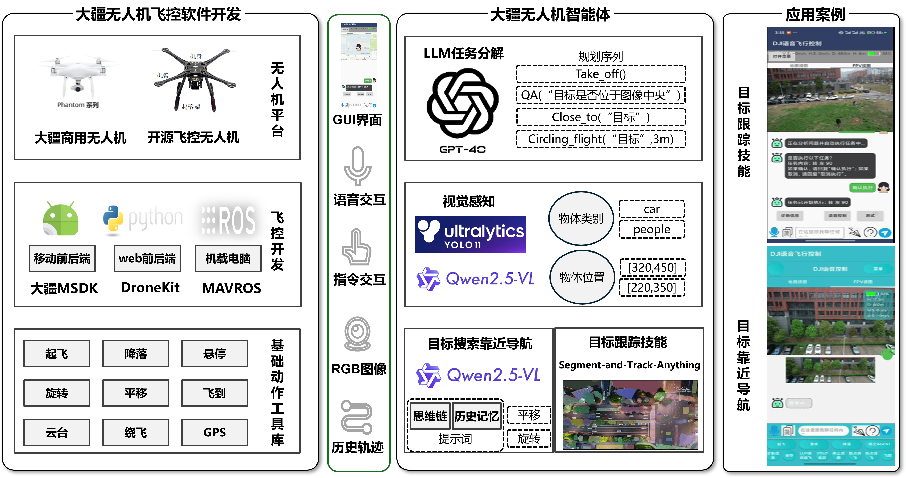
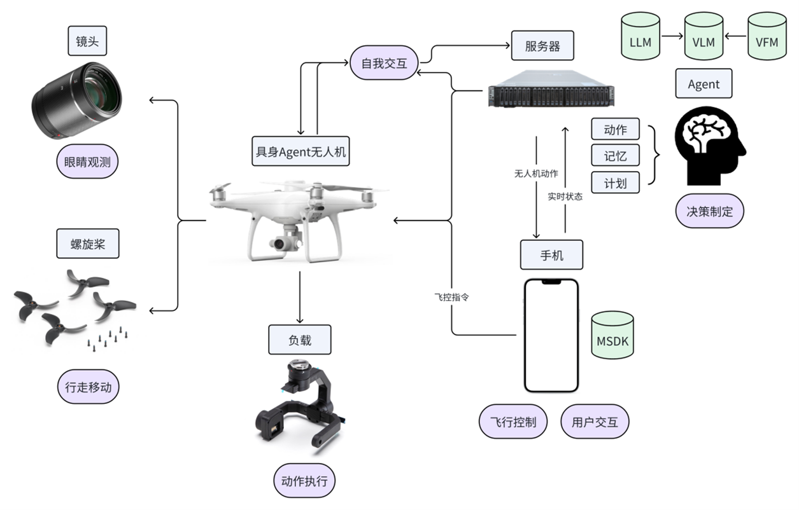
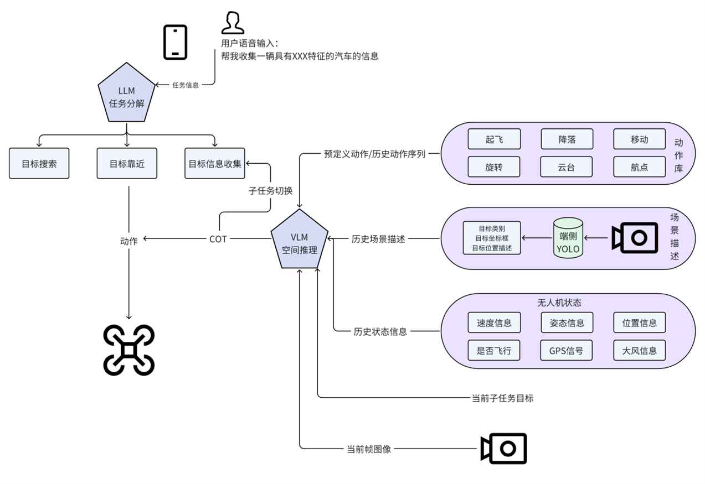

# Embodied Agent UAV

面向具身交互任务的智能体无人机系统

基于大疆 Mobile SDK（MSDK V4）二次开发的 Android 地面站，将无人机作为具身智能的物理载体：镜头作为“眼睛”观测环境，螺旋桨作为“腿脚”执行运动。手机端 APP 通过 MSDK 承担运动控制（小脑），云端 LLM / VLM 与端侧视觉基础模型承担认知决策（大脑），形成 **感知 — 决策 — 控制** 闭环。

<p align="center">
  
  &nbsp;
  
</p>
<p align="center">
  <em>左：目标靠近与信息收集 &nbsp;|&nbsp; 右：语音指令确认与执行</em>
</p>

## 简介

用户可用自然语言（语音或文字）下达高层次任务，例如「帮我收集红色车辆信息」。系统用大语言模型将任务分解为 **目标搜索 → 目标靠近 → 目标信息收集**，再由视觉语言模型结合实时画面、端侧 YOLO 场景描述和飞控状态，按思维链（CoT）选出低层次动作（平移、旋转、云台、绕飞等），经 MSDK 下发至 Phantom 4 系列无人机。

本仓库对应本科毕业论文《面向具身交互任务的智能体无人机系统设计》中的系统设计、算法、软件与实验部分。

## 系统架构

智能体由硬件平台、智能算法与软件平台三部分组成。手机 APP 是无人机、用户与云端模型之间的中继：USB 连接遥控器（MSDK），HTTP 连接 LLM / VLM。

<p align="center">
  
</p>
<p align="center"><em>总体架构：飞控开发栈、智能体决策链路与应用界面</em></p>

<p align="center">
  
</p>
<p align="center"><em>具身实体：镜头观测、螺旋桨移动、负载执行；手机 MSDK 飞控 + 云端 Agent 决策</em></p>

交互有两种方式：

- **人机交互**：语音 / 文本下达指令，紧急情况下人工介入接管。
- **自我交互**：无人机按「观测 — 推理 — 动作」与环境循环交互，形成可回溯的任务轨迹。

## 核心能力

### 运动控制（低层次动作库）

MSDK 只暴露 `pitch / roll / yaw / throttle` 四参数。本项目在 BODY 坐标系下用 GPS 闭环位置控制，把四参数封装成可调用动作（距离阈值约 0.3 m）：

| 动作 | 描述 | 实现 |
| --- | --- | --- |
| 六向平移 1/2/3 m | 上、下、左、右、前、后 | GPS 闭环 + 虚拟摇杆 |
| 双向旋转 45/90/180° | 左 / 右偏航 | 航向角闭环 |
| 云台下倾 30/60/90° | 改变俯视视角 | `gimbal.rotate()` |
| 定点绕飞 半径 5–8 m | 以 (lat, lon) 为圆心收集信息 | 圆周航点 + 航点飞行 |
| 起飞 / 降落 | 离地与着陆 | MSDK |
| 指定航点 (lon, lat) | 朝向校准后直线飞向目标 | GPS 闭环 |
| 子任务切换 / 悬停 | 任务调度与静止 | 控制算法 |

高层次能力由低层次动作组合而成：

| 高层次能力 | 组成动作 |
| --- | --- |
| 目标搜索 | 起飞、平移、旋转、云台 |
| 静态目标靠近 | 平移、旋转 |
| 目标信息收集 | 定点绕飞、航点飞行 |

### 感知、记忆与决策

- **端侧感知**：YOLOv10 经 PT → ONNX → NCNN 转换，在 Android 用 C++ / JNI 推理，输出单帧 JSON（类别、框、相对位置描述）。
- **滑动窗口记忆**：保留最近 5 帧场景描述与动作序列，作为下一轮推理的上下文，减轻幻觉。
- **思维链提示词**：按当前子任务在四种模式间切换——任务分解、空间推理、动作推理、自我反思（目标丢失时分析遮挡或视场角并恢复）。

<p align="center">
  
</p>
<p align="center"><em>任务执行：LLM 分解子任务，VLM 融合画面 / YOLO / 飞控状态后输出动作</em></p>

典型一拍流程：YOLO 描述当前帧 → 拼装历史轨迹与无人机状态 → VLM 输出推理过程与动作（如「向前移动 2 米」）→ 动作解析映射到 MSDK → 更新记忆，直到子任务完成再切换。

## 软件模块

Android APP（`voice_control/`）基于 DJI MSDK 4.18，主要模块：

| 模块 | 作用 |
| --- | --- |
| 语音识别 | 科大讯飞实时转写，长按说话 → 文本确认后执行 |
| 地图与航点 | 高德地图 SDK：位置显示、点选航点、地理编码查询 |
| 飞行控制与状态 | MSDK 注册连接、虚拟摇杆、航点 / 热点任务、FPV 图传、10 Hz 遥测 |
| 具身交互 | 对话窗口、任务分解、VLM 推理可视化、确认后执行 |
| 调试与存档 | 端上 Debug 面板；任务图像与推理文本保存为图 / TXT / HTML / PDF |

## 实验

硬件：大疆 Phantom 4 系列 + 遥控器 + Android 手机（USB 连接）。可先用 DJI Assistant 2 for Phantom 做模拟飞行，再在室外空旷、磁场正常的场地实测。

已验证：

1. **运动控制**：起飞至约 5 m 悬停、定点绕飞圆形轨迹、地图点选航点直线飞达。
2. **静态目标靠近**：锁定公交车 / 车辆后，根据目标在画面中的位置与尺度迭代平移；目标因视场角丢失时，自我反思后下俯云台 45° 重新锁定，直至居中悬停。
3. **具身交互任务**：指令「帮我收集红色车辆信息」被分解为搜索 → 靠近 → 绕飞收集，完整走通观察—推理—动作循环。

上图 GIF 分别为目标靠近过程与语音指令「左转 90°」的确认执行过程。

## 快速开始

### 环境

- Android Studio（AGP 7.1.2）
- JDK 8，`minSdk 24`，`compileSdk 34`，ABI：`armeabi-v7a` / `arm64-v8a`
- 大疆开发者账号与 [MSDK App Key](https://developer.dji.com/)
- 高德地图 Key、科大讯飞 AppID、GPT-4o（或兼容接口）的 API Key
- 真机：Phantom 4 系列；或 PC 端 DJI Assistant 2 模拟器

### 配置

1. 克隆本仓库，用 Android Studio 打开 `voice_control/`。
2. 在 `voice_control/app/src/main/AndroidManifest.xml` 中填入你自己的 DJI `com.dji.sdk.API_KEY` 与高德 `com.amap.api.v2.apikey`（请勿使用仓库里的示例值）。
3. 在 APP 设置或对应常量类中配置大模型与讯飞密钥。
4. 首次运行需联网完成 MSDK 注册；之后用 USB 连接遥控器，界面能读到飞行器状态即表示连接成功。

### 飞行

室外起飞前确认诊断信息为空（罗盘 / 磁场异常需重新标定或换场地）。语音或文本下发指令后，系统会弹出确认框，回复「确认执行」才会向飞控发送动作。紧急情况请立即用遥控器接管。

> **安全**：本项目会向真实无人机下发飞控指令。请在合法空域、遵守当地法规、保持目视与人工接管能力的前提下使用。

## 目录结构

```
.
├── fig/                          # 架构图与实验 GIF
├── voice_control/                # Android 工程
│   └── app/src/main/java/.../internal/
│       ├── controller/           # 连接、飞控、语音、对话主界面
│       ├── prompt/               # 任务分解 / VLM 提示词
│       └── ...
├── docs/                         # DJI MSDK API 文档
└── README.md
```

关键实现大致对应：

- 低层次飞控：`internal/controller/flightcontrol/`
- 具身任务智能体：`internal/controller/flightcontrol/agent/`
- 提示词：`internal/prompt/`
- 端侧 YOLO：`internal/controller/yolo/`

## 引用

若本项目对你的研究有帮助，请引用：

```
王铭涛. 面向具身交互任务的智能体无人机系统设计[D]. 沈阳: 东北大学, 2025.
```

```bibtex
@thesis{wang2025embodied,
  title     = {面向具身交互任务的智能体无人机系统设计},
  author    = {王铭涛},
  school    = {东北大学},
  year      = {2025},
  type      = {本科毕业论文}
}
```

## 致谢

指导教师车德福教授；课题组吴梦伟、李绍先、何嘉润等同学在 NCNN 部署与思维链设计上的帮助。底层飞控接口来自大疆 MSDK，端侧推理基于 [NCNN](https://github.com/Tencent/ncnn)。

## 许可

- 本仓库在 DJI Android SDK Sample 上二次开发。DJI Mobile SDK 遵循 [DJI EULA](http://developer.dji.com/policies/eula/)。
- Sample 代码部分遵循 MIT License，详见 `LICENSE.txt`。
- 请自行申请并妥善保管第三方 API Key，不要将密钥提交到公开仓库。
